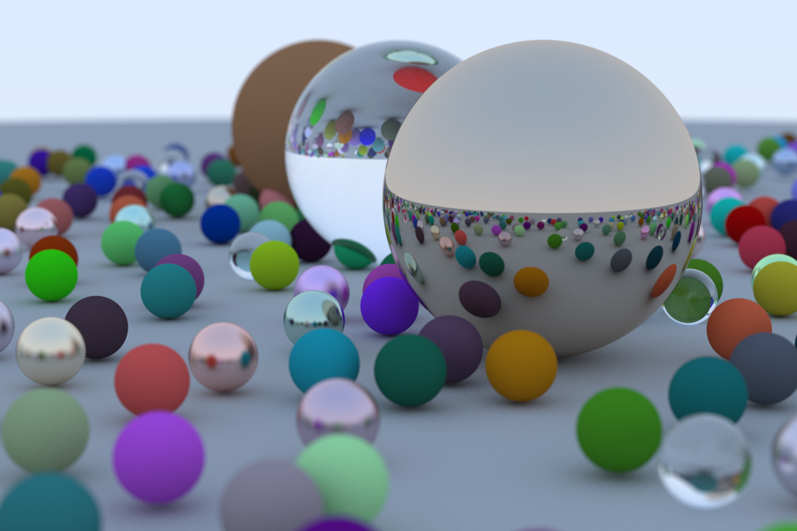

# Ray tracer in rust 用 Rust写的一个光线追踪器

Rust语言的练习和光线最终的学习。

## 来源

[_Ray Tracing in One Weekend_](https://raytracing.github.io/books/RayTracingInOneWeekend.html)

利用Rust实现了书中所说的绝大部分效果，有些小改动。

前期参考的是该书的旧版本，后来切换到了新版本。

## 最终渲染

渲染时长：7280259ms

最终效果：
